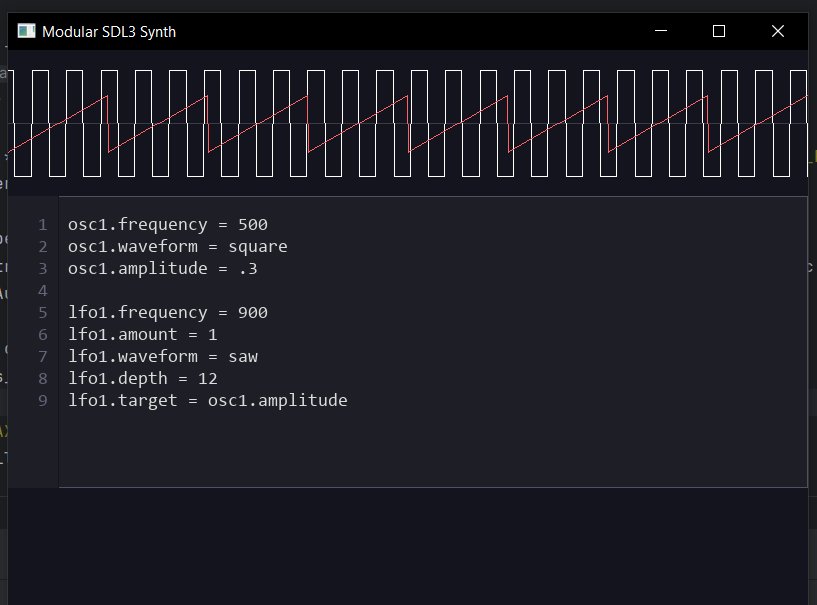

# CodeSynth 🎛️



**CodeSynth** is a lightweight programmable synthesizer that allows you to create music using simple text commands.

Instead of using a graphical interface, you describe oscillators, filters, and LFOs directly in code.
This makes it easy to experiment with sound design, automate modulation, and build generative music systems.

The engine parses a text configuration and converts it into real-time audio synthesis.

---

## Features

* 🎚 Multiple oscillators
* 🌊 Multiple waveform types (sine, square, triangle, saw, noise)
* 🔁 LFO modulation system
* 🎛 Configurable filters
* 📜 Simple scripting language
* ⚡ Real-time parameter updates
* 🎧 Stereo panning support

---

## Example

A simple patch:

```
# Oscillators
osc1.wave = saw
osc1.freq = 220
osc1.amp = 0.6

osc2.wave = square
osc2.freq = 440
osc2.amp = 0.3
osc2.detune = 0.5

# Filter
filter.type = lowpass
filter.cutoff = 1200
filter.resonance = 1.5
filter.enabled = 1

# LFO
lfo1.waveform = sine
lfo1.frequency = 2.0
lfo1.depth = 0.8
lfo1.amount = 100
lfo1.target = osc1.frequency
lfo1.enabled = 1

# Master
volume = 0.8
```

This configuration will:

* create two oscillators
* apply a low-pass filter
* modulate the frequency of oscillator 1 using an LFO
* output the final signal at 80% master volume

---

## Supported Commands

### Oscillator

```
oscX.freq = <float>
oscX.wave = sine | square | triangle | saw | noise
oscX.amp = <0.0 - 1.0>
oscX.detune = <float>
oscX.phase = <float>
oscX.pan = <-1.0 ... 1.0>
```

Example:

```
osc1.wave = sine
osc1.freq = 440
osc1.amp = 0.8
```

---

### LFO

```
lfoX.frequency = <float>
lfoX.waveform = sine | square | triangle | saw | noise
lfoX.depth = <0.0 - 1.0>
lfoX.amount = <float>
lfoX.target = <parameter>
lfoX.enabled = 0 | 1
```

Example:

```
lfo1.waveform = sine
lfo1.frequency = 4
lfo1.depth = 0.7
lfo1.target = osc1.frequency
```

---

### Filter

```
filter.type = lowpass | highpass | bandpass | notch
filter.cutoff = <Hz>
filter.resonance = <float>
filter.enabled = 0 | 1
```

Example:

```
filter.type = lowpass
filter.cutoff = 800
filter.resonance = 2.0
```

---

### Master Volume

```
volume = <0.0 - 2.0>
```

---

## Architecture

The system consists of several main modules:

| Module         | Description                                  |
| -------------- | -------------------------------------------- |
| Oscillator     | Generates base waveforms                     |
| LFO            | Low frequency modulation                     |
| Filter         | Audio filtering                              |
| Command Parser | Converts text commands into synth parameters |
| Audio Engine   | Generates the final sound output             |

The parser reads a script line by line and updates the synth components in real time.

---

## Example Use Cases

* 🎹 Procedural music generation
* 🔬 DSP experimentation
* 🎮 Game audio prototyping
* 🧠 Learning audio synthesis
* 🛠 Building custom synth tools

---

## Building

Compile the project with a standard C compiler:

```
gcc main.c oscillator.c lfo.c filter.c command_parser.c -o codesynth -lm
```

Run it:

```
./codesynth script.txt
```

---

## Roadmap

Future improvements:

* ADSR envelopes
* MIDI input
* Polyphony
* Preset system
* Effects (delay / reverb / distortion)
* GUI editor
